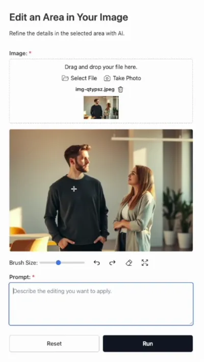
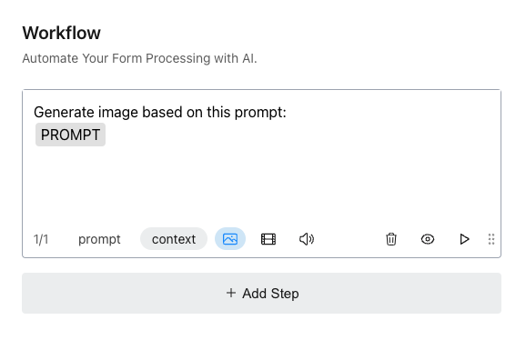

# FormBuilderAI.js Developer's Guide

FormBuilder.js is a JavaScript library for creating web forms and AI-powered tools. You can use it as a standard form builder or as a tool to generate insights, reports, edit images, generate videos, and more.

FormBuilderAI.js is designed to integrate effectively with OpenAI or OpenRouter for text generation and with [Fal.ai](http://fal.ai/) for media generation, including images, videos, and audio. 

Example usages are provided for HTML, React with Node.js, Next.js, PHP, and Laravel. As an ES6 JavaScript library, it can be used in most modern development environments.

# Getting Started

## Installation

There are two ways to install FormBuilderAI.js:

**Option 1: Import**

```jsx
import FormBuilderAI from '@innovastudio/formbuilderai';
import '@innovastudio/formbuilderai/public/formbuilderai/formbuilderai.css';
```

**Option 2: CDN/Script Tag**

```jsx
<link href="formbuilderai/formbuilderai.css" rel="stylesheet">
<script src="formbuilderai/formbuilderai.min.js"></script>
```

## Basic Usage

### Step 1: Set Up Your HTML

Create a container for your form builder

```html
<div class="form-editor"></div>
```

### Step 2: Initialize the Form Builder

Add this JavaScript code to initialize FormBuilderAI:

```jsx
const builder = new FormBuilderAI({
    builderSelector: '.form-editor', // selector for the container
});

builder.load(); // Load the editor interface
```

### Step 3: Handle Form Changes

Add an event listener to capture form changes:

```jsx
builder.on('change', (formData) => {
    // formData contains your form structure as a JSON string
    console.log(JSON.parse(formData));
    
    // Save the form data wherever you need
});
```

Result:


## Loading and Saving Forms

Example:

```jsx
const builder = new FormBuilderAI({
  builderSelector: '.form-editor',
})
.on('change', (formData) => {
  console.log('Form updated:', JSON.parse(formData));
  localStorage.setItem('formData', formData); // Save to localStorage
});

// Load saved form or default example
const savedData = localStorage.getItem('formData') || getExampleForm();
builder.load(savedData);

function getExampleForm() {
  return JSON.stringify({
    title: "Register for the Tech Conference",
    description: "Join us for an insightful and engaging experience.",
    elements: [
      {
        title: "Full Name",
        type: "short-text",
        isRequired: true
      },
      // ... other fields
    ]
  });
}
```

In this example, form is saved to localStorage for demonstration purpose.

**Key Features:**

- **`load(formData)` Method** :
    
    Loads form data (stringified JSON) and displays it in the editor.
    
- **`change` Event** :
    
    Triggered during form editing whenever changes are made to the form structure.
    

Result:


To run the example, open **`public/example1.html`** from the package.

## Form Preview

### Step 1: HTML Setup

Create a container for your form preview.

```html
<div class="build-container">
  <div class="form-editor"></div>
  <div class="form-preview"></div>
</div>
```

Add the style.

```jsx
.build-container {
    display: flex;
    flex-direction: row;
    justify-content: space-between;
    max-width: 1400px;
    margin: 20px auto;
}
.form-editor, 
.form-preview {
    width: 100%;
    max-width: 600px;
    padding: 30px;
}
```

### Step 2: Enable Form Preview

Specify the **`previewSelector`** parameter to enable live preview functionality.

```jsx
const builder = new FormBuilderAI({
  builderSelector: '.form-editor',
  previewSelector: '.form-preview',
})
.on('change', (formData) => {
  console.log('Form updated:', JSON.parse(formData));
  localStorage.setItem('formData', formData); // Save to localStorage
});

// Load saved form or default example
const savedData = localStorage.getItem('formData') || getExampleForm();
builder.load(savedData);

function getExampleForm() {
  return JSON.stringify({
    title: "Register for the Tech Conference",
    description: "Join us for an insightful and engaging experience.",
    elements: [
      {
        title: "Full Name",
        type: "short-text",
        isRequired: true
      },
      // ... other fields
    ]
  });
}
```

**Key Parameter**

- **`previewSelector`**: selector for live preview container

Result:


Now changes in the form editor are **immediately reflected** in the preview pane.

To run the example, open **`public/example2.html`** from the package.

## Form Settings

The Form Settings panel provides controls to configure the forms.

### **Step 1: HTML Setup**

Create containers for the settings and preview:

```jsx
<div class="build-container">
  <div class="form-settings"></div>
  <div class="form-preview"></div>
</div>

<style>
.build-container {
  display: flex;
  gap: 2rem;
  max-width: 1400px;
  margin: 20px auto;
}
.form-settings, .form-preview {
  width: 100%;
  max-width: 600px;
  padding: 30px;
}
</style>
```

### **Step 2: Enable Form Settings**

Specify the **`settingsSelector`** parameter to enable designer functionality.

```jsx
const builder = new FormBuilderAI({
  settingsSelector: '.form-settings', // Settings container
  previewSelector: '.form-preview'    // Preview container
})
.on('change', (formData) => {
  console.log('Form updated:', JSON.parse(formData));
  localStorage.setItem('formData', formData); // Save configuration
});

// Load saved form or default example
const savedData = localStorage.getItem('formData') || getExampleForm();
builder.load(savedData);
```

**Key Parameters**

- **`settingsSelector`** : Container for the settings panel
- **`previewSelector`** : Container for live preview
- **`change` Event** : Triggers when settings are modified

Result:


To run the example, open **`public/example3.html`** from the package.

## Form Designer

The Form Designer panel allows users to customize the visual style of forms. It works alongside the Form Builder to provide a complete design experience.

### **Step 1: HTML Setup**

Create containers for the designer and preview:

```jsx
<div class="build-container">
  <div class="form-designer"></div>
  <div class="form-preview"></div>
</div>

<style>
.build-container {
  display: flex;
  gap: 2rem;
  max-width: 1400px;
  margin: 20px auto;
}
.form-designer, .form-preview {
  width: 100%;
  max-width: 600px;
  padding: 30px;
}
</style>
```

### **Step 2: Enable Form Designer**

Specify the **`designerSelector`** parameter to enable designer functionality.

```jsx
const builder = new FormBuilderAI({
  designerSelector: '.form-designer',  // Designer container
  previewSelector: '.form-preview'     // Preview container
})
.on('themeChange', (themeData) => {
  localStorage.setItem('themeData', themeData); // Save theme
});

// Load form
const savedForm = localStorage.getItem('formData') || getDefaultForm();
builder.load(savedForm);

// Apply saved theme
const savedTheme = localStorage.getItem('themeData') || '';
builder.setTheme(savedTheme);
```

**Key Features**

- **`designerSelector`** : Container for the designer interface.
- **`themeChange` event** : Triggers when styling changes are made.
- **`setTheme(themeData)`** : Applies saved theme.

Result:


To run the example, open **`public/example4.html`** from the package.

## Enable All (Form Editor, Designer, Settings and Preview Panels)

### **Step 1: HTML Setup**

Create containers for the editor, designer, settings and preview:

```jsx
<div class="form-editor"></div>
<div class="form-designer"></div>
<div class="form-settings"></div>
<div class="form-preview"></div>
```

### **Step 2: Enable the Panels**

```jsx
const builder = new FormBuilderAI({
    builderSelector: '.form-editor', 
    previewSelector: '.form-preview', 
    settingsSelector: '.form-settings',
    designerSelector: '.form-designer'
})
```

For better organization, these panels can be arranged in a tabbed interface for easy navigation.

To run the example, open **`public/example5.html`** from the package.

# Workflow

FormBuilderAI.js can do more than just create basic forms like contact and registration forms. With its Workflow feature, you can build tools that use AI to process form data.

When users fill out forms, the Workflow feature can use AI to create content based on their answers. This lets you make tools for many different tasks.

This feature supports integration with OpenAI or OpenRouter. Server-side endpoints are required, with examples available for Node.js, Next.js, and PHP.

Here is an example of a form and its workflow:


Workflow:


Example result:


To enable the Workflow feature:

### **Step 1: HTML Setup**

Add elements for the workflow panel and the result.

```jsx
<div class="form-workflow"></div>
<div class="workflow-result"></div>
```

### **Step 2: Enable the Panels**

```jsx
const builder = new FormBuilderAI({
  builderSelector: '.form-editor',        // Form editor container
  previewSelector: '.form-preview',       // Preview container
  settingsSelector: '.form-settings',     // Settings panel container
  designerSelector: '.form-designer',     // Designer panel container
  workflowSelector: '.form-workflow',     // Workflow panel container
  resultSelector: '.workflow-result',     // Result container

  // Using OpenRouter
  model: 'openai/gpt-4o-mini',            // Model for content generation
  model2: 'openai/gpt-4o-mini',           // Model for processing (function calling)
  sendCommandUrl: 'http://localhost:8083/openrouter', // Node.js endpoint
  sendCommandStreamUrl: 'http://localhost:8083/openrouter_stream',
})
.on('change', (formData) => {
  console.log('Form updated:', JSON.parse(formData));
  localStorage.setItem('myFormData', formData); // Save form data
})
.on('workflowChange', (workflowData) => {
  console.log('Workflow updated:', JSON.parse(workflowData));
  localStorage.setItem('myworkflowData', workflowData); // Save workflow
})
.on('resultReady', ({ previewText, markdown, html, media }) => {
  console.log('Result generated:', { previewText, markdown, html, media });
  // Save or display the result
});
```

**Key Features**

- **`workflowSelector`** : Container for the workflow interface
- **`resultSelector`** : Container for displaying workflow results
- **`model` and `model2`** : AI models used for content generation and processing
- **`sendCommandUrl` and `sendCommandStreamUrl`** : Endpoints for sending requests to the AI model
- **`workflowChange` event**: Triggered during workflow editing whenever changes are made. You can use this event to save the workflow.
- **`resultReady` event**: Triggered when the form submission returns a result.

### Step 2: Loading Form

In this example, the form includes a single input field where users can describe their products or services.

```jsx
let exampleForm = {
    "title": "Ideas Generator for Bold Change",
    "description": "Transform your product or service with ideas that lead the disruption.",
    "elements": [
        {
            "title": "Describe Your Product/Service:",
            "name": "your_product_or_service",
            "type": "long-text",
            "isRequired": true,
            "placeholder": "Enter a brief description of your product or service"
        },
    ],
    "useSubmitButton": true,
    "submitText": "Send"
};
let exampleFormData = JSON.stringify(exampleForm);

let formData = localStorage.getItem('myFormData') || exampleFormData; 
builder.load(formData);
```

### **Step 3: Loading a Workflow**

Then, we create a workflow with two steps to process the input and generate ideas and a marketing pitch.

```jsx
const exampleWorkflow = {
    steps: [
        { 
            prompt: `Based on the following product/service: {{YOUR_PRODUCT_OR_SERVICE}}

Give me 3 bold, innovative ideas that redefine the market by solving important problems for users. Explain each with use case from users' perspective. ` ,
        },
        { 
            prompt:`From the following feature ideas:
{{OUTPUT_STEP_1}}

Create a one-paragraph intro or pitch for each, inspired by the style of a TED Talk introduction.`
        },
    ]
};
let exampleWorkflowData = JSON.stringify(exampleWorkflow);

let workflowData = localStorage.getItem('myworkflowData') || exampleWorkflowData; 
builder.loadWorkflow(workflowData);
```

**Key Concepts:**

- Use placeholders like **`{{YOUR_PRODUCT_OR_SERVICE}}`** to reference form fields or outputs from earlier steps.
- Use placeholders like **`{{OUTPUT_STEP_1}}`** or **`{{OUTPUT_STEP_2}}`** to reference outputs from earlier steps.

To run the example, open **`public/example6.html`** from the package.

### API Keys

To run the example, obtain API key from OpenRouter or OpenAI. 

[https://openrouter.ai](https://openrouter.ai) 

or

[https://openai.com](https://openai.com) 

Use OpenRouter if you want to use various models.

Update the **`.env`**  file with your API key.

```jsx
OPENROUTER_API_KEY=YOUR_API_KEY
```

or

```jsx
OPENAI_API_KEY=YOUR_OPENAI_API_KEY
```

To run the PHP example, update the **`api/config.php`** file with your API key:

```jsx
$OPENROUTER_API_KEY = 'YOUR_API_KEY';
```

or

```jsx
 $OPENAI_API_KEY = 'YOUR_API_KEY';
```

### Server Side/API Endpoints

In the previous example, we specify two parameters for the API endpoints:

```jsx
const builder = new FormBuilderAI({

  // ...
  sendCommandUrl: 'http://localhost:8083/openrouter', 
  sendCommandStreamUrl: 'http://localhost:8083/openrouter_stream',
})
```

The **`sendCommandUrl`** is required, while the **`sendCommandStreamUrl`** is optional. The **`sendCommandStreamUrl`** serves the same purpose as **`sendCommandUrl`** but has streaming support for faster result display.

If you’re using PHP, you can point to PHP endpoints like this:

```jsx
const builder = new FormBuilderAI({

  // ...
  sendCommandUrl: '/api/openrouter.php', 
  sendCommandStreamUrl: '/api/openrouter_stream.php',
})
```

Server-side endpoint examples are provided for Node.js, Next.js, and PHP. You can create your own endpoints for other server-side environments by following the code in the provided examples.

**Node.js Example:**

**`server.js`**

```jsx
app.post('/openrouter', async (req, res) => {

    try {
        const OPENROUTER_API_KEY = process.env.OPENROUTER_API_KEY;
        
        const url = "https://openrouter.ai/api/v1/chat/completions";
        const DEFAULT_MODEL = 'openai/gpt-4o-mini'; 
        const DEFAULT_TEMPERATURE = 0.6;
        const DEFAULT_TOP_P = 0.9;
        const DEFAULT_NUM = 1;

        let { question, context, system, functs, temperature, topP, num, model } = req.body;

        const messages = [
            { role: 'system', content: system },
            { role: 'assistant', content: context || '' },
            { role: 'user', content: question }
        ];

        try {
            if(functs.length>0) { // function calling

                const tools = [
                    {
                        type: "function",
                        function: {
                            ...functs[0]
                        }
                    }
                ];

                const response = await axios.post(url, {
                    model: model || DEFAULT_MODEL,
                    messages,
                    temperature: parseFloat(temperature) || DEFAULT_TEMPERATURE,
                    top_p: parseFloat(topP) || DEFAULT_TOP_P,
                    n: parseInt(num) || DEFAULT_NUM,
                    tools,
                }, {
                    headers: {
                    'Content-Type': 'application/json',
                    'Authorization': `Bearer ${OPENROUTER_API_KEY}`,
                    },
                    validateStatus: () => true, // Always resolves the promise
                });

                if(response.data && response.data.error && response.data.error.message) {
                    res.json({ ok: false, status: 404, error: response.data.error.message });
                }

                let answer =
                    functs.length === 0
                        ? response.data
                        : response.data.choices[0].message.tool_calls
                        ? response.data.choices[0].message.tool_calls[0].function.arguments
                        : response.data.choices[0].message;
                let usage = response.data.usage;

                res.json({ answer, usage });

            } else { // content generation

                const response = await axios.post(url, {
                    model: model || DEFAULT_MODEL,
                    messages,
                    temperature: parseFloat(temperature) || DEFAULT_TEMPERATURE,
                    top_p: parseFloat(topP) || DEFAULT_TOP_P,
                    n: parseInt(num) || DEFAULT_NUM
                }, {
                    headers: {
                    'Content-Type': 'application/json',
                    'Authorization': `Bearer ${OPENROUTER_API_KEY}`,
                    },
                });

                let answer = response.data;
                let usage = response.data.usage;
    
                res.json({ answer, usage });

            }
            
        } catch (error) {
            res.json({ error: error.message });
        }

    } catch(e) {
        res.status(200).json({ error: 'Something went wrong.' });
    }
});
```

**PHP example:**

**`api/openrouter.php`**

```php
<?php
require_once 'config.php';

set_time_limit(60);

$url = 'https://openrouter.ai/api/v1/chat/completions';
$DEFAULT_MODEL = 'openai/gpt-4o-mini'; 
$DEFAULT_TEMPERATURE = 0.6;
$DEFAULT_TOP_P = 0.9;
$DEFAULT_NUM = 1;

if ($_SERVER['REQUEST_METHOD'] === 'POST') {
    $body = json_decode(file_get_contents('php://input'), true);
    $question   = $body['question'];
    $context    = $body['context'];
    $system     = $body['system'];
    $functs     = $body['functs'];
    $temperature= $body['temperature'];
    $topP       = $body['topP'];
    $num        = $body['num'];
    $model      = isset($body['model']) ? $body['model'] : null;

    $messages = [
        ['role' => 'system', 'content' => $system],
        ['role' => 'assistant', 'content' => $context ?: ''],
        ['role' => 'user', 'content' => $question]
    ];

    $headers = [
        'Content-Type: application/json',
        'Authorization: Bearer ' . $OPENROUTER_API_KEY,
    ];

    $data = [
        'model'        => $model ?: $DEFAULT_MODEL,
        'messages'     => $messages,
        'temperature'  => isset($temperature) ? floatval($temperature) : $DEFAULT_TEMPERATURE,
        'top_p'        => isset($topP) ? floatval($topP) : $DEFAULT_TOP_P,
        'n'            => isset($num) ? intval($num) : $DEFAULT_NUM,
    ];

    if (!empty($functs)) {
        $data['tools'] = [
            [
                'type' => 'function',
                'function' => $functs[0]
            ]
        ];
    }

    $ch = curl_init();
    curl_setopt($ch, CURLOPT_URL, $url);
    curl_setopt($ch, CURLOPT_HTTPHEADER, $headers);
    curl_setopt($ch, CURLOPT_POST, 1);
    curl_setopt($ch, CURLOPT_POSTFIELDS, json_encode($data));
    curl_setopt($ch, CURLOPT_RETURNTRANSFER, true);
    curl_setopt($ch, CURLOPT_SSL_VERIFYHOST, 0);
    curl_setopt($ch, CURLOPT_SSL_VERIFYPEER, 0);
    
    $response = curl_exec($ch);

    if ($response === false) {
        echo 'cURL Error: ' . curl_error($ch);
    } else {
        $responseData = json_decode($response, true);

        if (empty($functs)) {
            $answer = $responseData;
        } else {
            if (isset($responseData['choices']) && isset($responseData['choices'][0]['message'])) {
                if (isset($responseData['choices'][0]['message']['tool_calls'][0]['function']['arguments'])) {
                    $answer = $responseData['choices'][0]['message']['tool_calls'][0]['function']['arguments'];
                } else {
                    $answer = $responseData['choices'][0]['message'];
                }
            } else {
                $answer = null;
            }
        }

        echo json_encode(['answer' => $answer]);
        curl_close($ch);
    }
}
?>
```

# Media Generation

FormBuilderAI.js is designed to integrate effectively with [Fal.ai](http://fal.ai/) for media generation, including images, videos, and audio. With this integration, you can create forms that use the latest AI models.

The example below shows a form and workflow created for editing images:


Result:



To create a form for image generation, you can simply write a workflow like this:



lternatively, you can provide more detailed instructions, like the following:


To enable image generation, toggle the Image button on.

For more advanced use and flexibility, you can also enter JSON data, specify the model to be used, and select a provider.


In this example, we use the model **`fal-ai/bria/eraser`** to erase specified objects from an image. The JSON format used in the workflow must adhere to the input format required by the model. Refer to the [Fal.ai](http://fal.ai/) website for the JSON structure:

[https://fal.ai/models/fal-ai/bria/eraser](https://fal.ai/models/fal-ai/bria/eraser)

## Enable Media Generation

Some endpoints are required to enable the media generation feature.

```jsx
const builder = new FormBuilderAI({

    // ...
    
    imageToggle: true,
    videoToggle: true,
    audioToggle: true,

    // Upload Endpoints (3 options): Local Server, Fal Storage, or S3 Storage
    // uploadMediaUrl_Fal: 'http://localhost:8083/upload', // Local Server
    // uploadBase64Url_Fal: 'http://localhost:8083/uploadbase64', 
    uploadMediaUrl_Fal: 'http://localhost:8083/uploadfile-fal', // Fal Storage
    uploadBase64Url_Fal: 'http://localhost:8083/uploadbase64-fal',
    // uploadMediaUrl_Fal: 'http://localhost:8083/uploadfile-s3', // S3 Storage
    // uploadBase64Url_Fal: 'http://localhost:8083/uploadbase64-s3',
    
    // Fal Integration Endpoints:
    generateMediaUrl_Fal: 'http://localhost:8083/request-fal', // request generation
    checkRequestStatusUrl_Fal: 'http://localhost:8083/status-fal', // check generation status
    getResultUrl_Fal: 'http://localhost:8083/result-fal', // receive result

    // Optimization & Cleanup Endpoints:
    minimizeImageUrl: 'http://localhost:8083/minimizer', // minimize image file size
    cleanup: 'http://localhost:8083/cleanup', // cleanup input files

})
```

### Media Generation Buttons

- **`imageToggle`**: Shows or hides the Image button.
- **`videoToggle`**: Shows or hides the Video button.
- **`audioToggle`**: Shows or hides the Audio button.

### **Upload Endpoints**

- **`uploadMediaUrl_Fal`**
- **`uploadBase64Url_Fal`**

Upload endpoints are required if your form includes file inputs (e.g., for editing a user-provided image).

**Storage Options:**

- Your Server
- Fal Storage
- S3 Storage (AWS S3)

**Notes:**

- If you are using your own server for storage, ensure that the uploaded file is accessible externally (not **`localhost`** ) for Fal to process during generation.
- File inputs are considered temporary. When using your own server or S3 storage, the files are removed after generation.
- For PHP, Fal Storage option is not supported.

### **FAL Integration Endpoints**

- **`generateMediaUrl_Fal`**: Requests generation
- **`checkRequestStatusUrl_Fal`**: Monitors generation progress
- **`getResultUrl_Fal`**: Retrieves the result

### **Optimization & Cleanup Endpoints**:

- **`minimizeImageUrl`**: Reduces image file size
- **`cleanup`**: Removes input files after generation

In the example code, **`generateMediaUrl_Fal`** is set to **`/request_fal`** . Here is the Node.js code:

```
app.post('/request-fal',  async (req, res) => {

    let { model, customData, payload } = req.body;

    let input = payload;

    try {
        const { request_id } = await fal.queue.submit(model, { input } );

        res.json({  ok: true, request_id });

    } catch(err) {
        const message = (err.body && err.body.detail) || err.message;
        res.json({ ok: false, error: err.message });
    }
});
```

Please refer to **`server.js`** in the package for other endpoints.

For PHP example, refer to **`request-fal.php`** and other files in the **`public/api`** folder.  You can use this example to implement it in a Laravel project.

# Templates

Templates are a collection of ready-made forms with workflows that you can load and use for various tasks. Templates are defined in a JSON file, **`templates.json`**, located in:

 **`public/templates.json`**

It requires assets (image files for thumbnails) located in:

 **`public/formfiles/`**


## Enable Templates

### Step 1: HTML Setup

Create a container for templates.

```jsx
<div class="form-templates"></div>
```

### Step 2: Configure Templates

```jsx
const builder = new FormBuilderAI({

	// ...

  templatesSelector: '.form-templates',

  assetsFolder: '/formfiles/',
  templatesUrl: '/templates.json', 
  templateFilters: ['all', 'image', 'video', 'audio', 'text'],
            
}).on('templateSelect', (template) => {

    console.log('Selected template:', template);

    // Load form
    const formData = JSON.stringify(template.form);
    builder.load(formData);

    // Load workflow
    const workflowData = JSON.stringify(template.workflow);
    builder.loadWorkflow(workflowData);

}).on('change', (formData) => {

	// ...

}).on('workflowChange', (workflowData) => {

	// ...

}).on('resultReady', ({ previewText, markdown, html, media }) => {

	// ...

});

//Load Templates
builder.loadTemplates();
```

**Key Features**

- **`templatesSelector`** : Container for the templates interface.
- **`assetsFolder`** : Location of the templates’ assets.
- **`templatesUrl`** : URL of the templates JSON file.
- **`templatesFilters`** : List of filters for displaying templates.
- **`templateSelect` event**: Triggered when a template is selected.
- **`loadTemplates` method**: display the templates.

In the example code, when a template is selected, the selected template’s form and workflow is loaded and displayed.

# Form Viewer using FormViewer.js

FormViewer.js is a separate library from FormBuilderAI.js used for displaying forms. You can use it independently of FormBuilderAI.js to embed forms on a webpage.

## Installation

There are two ways to install FormViewer.js:

**Option 1: Import**

```jsx
import FormBuilderAI from '@innovastudio/formviewer';
import '@innovastudio/formviewer/public/formviewer/formviewer.css';
```

**Option 2: CDN/Script Tag**

```jsx
<link href="formviewer/formviewer.css" rel="stylesheet">
<script src="formviewer/formviewer.min.js"></script>
```

## Basic Usage

### Step 1: Set Up Your HTML

Create a container for your form builder

```html
<form>
    <div class="myform"></div>
</form>
```

### Step 2: Initialize the Form Viewer

Add this JavaScript code to initialize FormViewer:

```jsx
const elm = document.querySelector('.myform');
viewer = new FormViewer(elm, {

    // ...

});

let exampleForm = {
    "title": "Register for the Tech Conference",
    "description": "Join us for an insightful and engaging experience.",
    "elements": [
        {
            "title": "Full Name:",
            "name": "full_name",
            "type": "short-text",
            "isRequired": true,
            "placeholder": "Enter your full name"
        },
        
        //...
    ],
    "useSubmitButton": true,
    "submitText": "Submit"
};

let exampleFormData = JSON.stringify(exampleForm)

viewer.view(exampleFormData);
```

**Key Feature**

- **`view` method**: display the form.

Result:


## Displaying a Form with Workflow

### Step 1: Set Up Your HTML

Create a container for your form builder

```html
<form>
    <div class="myform"></div>
    <div class="result"></div>
</form>
```

### Step 2: Initialize the Form Viewer

Add this JavaScript code to initialize FormViewer:

```jsx
const elm = document.querySelector('.myform');
viewer = new FormViewer(elm, {

  resultSelector: '.result',

  model: 'openai/gpt-4o-mini', // for content generation
  model2: 'openai/gpt-4o-mini', // for processing (function calling)
  sendCommandUrl: 'http://localhost:8082/openrouter', 
  sendCommandStreamUrl: 'http://localhost:8082/openrouter_stream',

});

const exampleForm = {
    "title": "Create a Strong Brand Identity",
    "description": "Get unique, memorable, and impactful brand name suggestions that reflect your vision.",
    "elements": [
        {
            "title": "Your Product or Service:",
            "name": "your_product_or_service",
            "type": "short-text",
            "isRequired": true,
            "placeholder": "Describe your product or service.",
            "value": ""
        },
        {
            "title": "Your Target Audience:",
            "name": "your_target_audience",
            "type": "short-text",
            "isRequired": true,
            "placeholder": "e.g., developers, agencies",
            "value": ""
        }
    ],
    "submitText": "Generate Names",
    "resetText": "Reset",
    "hideReset": false,
    "fullWidthButton": true,
    "hideHeader": false,
    "useSubmitButton": true,
    "thumbnail": "ai-YrRaO.jpg"
};

let exampleFormData = JSON.stringify(exampleForm)

viewer.view(exampleFormData);

// Load Workflow
const exampleWorkflow = {
    "steps": [
        {
            "prompt": "I want to create a strong brand identity for my product/service: {{YOUR_PRODUCT_OR_SERVICE}}. \nPlease suggest 10 unique brand name ideas that are modern, innovative, and convey quality. The names should be memorable, easy to pronounce, and align with {{YOUR_TARGET_AUDIENCE}} and its values.",
            "context": ""
        }
    ]
};
let exampleWorkflowData = JSON.stringify(exampleWorkflow);

viewer.loadWorkflow(exampleWorkflowData);
```

**Key Features**

- **`resultSelector`**: Container for displaying the result.
- **`model` and `model2`** : AI models used for content generation and processing
- **`sendCommandUrl` and `sendCommandStreamUrl`** : Endpoints for sending requests to the AI model
- **`view` method**: Display the form.
- **`loadWorkflow` method**: Load the workflow.

Result:


## Displaying a Form for Media Generation

Example:


### Step 1: Set Up Your HTML

Create a container for your form builder

```html
<form>
    <div class="myform"></div>
    <div class="result"></div>
</form>
```

### Step 2: Initialize the Form Viewer

Add this JavaScript code to initialize FormViewer:

```jsx
const elm = document.querySelector('.myform');
viewer = new FormViewer(elm, {

  resultSelector: '.result',

  model: 'openai/gpt-4o-mini', // for content generation
  model2: 'openai/gpt-4o-mini', // for processing (function calling)
  sendCommandUrl: 'http://localhost:8082/openrouter', 
	sendCommandStreamUrl: 'http://localhost:8082/openrouter_stream',

  // Media Generation

  // Upload Endpoints (3 options):

  // Option 1: Local Server
  // uploadMediaUrl_Fal: 'http://localhost:8082/upload',
  // uploadBase64Url_Fal: 'http://localhost:8082/uploadbase64', 

  // Option 2: Fal Storage
  uploadMediaUrl_Fal: 'http://localhost:8082/uploadfile-fal', 
  uploadBase64Url_Fal: 'http://localhost:8082/uploadbase64-fal',

  // Option 3: S3 Storage
  // uploadMediaUrl_Fal: 'http://localhost:8082/uploadfile-s3',
  // uploadBase64Url_Fal: 'http://localhost:8082/uploadbase64-s3',

  // Fal Integration Endpoints:
  generateMediaUrl_Fal: 'http://localhost:8082/request-fal', // request generation
  checkRequestStatusUrl_Fal: 'http://localhost:8082/status-fal', // check generation status
  getResultUrl_Fal: 'http://localhost:8082/result-fal', // receive result

  // Optimization & Cleanup Endpoints:
  minimizeImageUrl: 'http://localhost:8082/minimizer', // minimize image file size
  cleanup: 'http://localhost:8082/cleanup', // cleanup input files

  saveResults: true, // display the latest generated result (saved in localStorage).

});

// Load Form
let exampleForm = {
  "title": "Edit an Area in Your Image",
  "description": "Refine the details in the selected area with AI.",
  "elements": [
    {
      "title": "Image:",
      "name": "image",
      "type": "file",
      "fieldNote": "",
      "isRequired": true,
      "useImageMask": true,
      "source": "local_and_camera",
      "allowedFileTypes": [
        "images"
      ]
    },
    {
      "title": "Prompt:",
      "name": "prompt",
      "type": "long-text",
      "fieldNote": "",
      "isRequired": true,
      "placeholder": "Describe the editing you want to apply.",
      "value": "",
      "height": "120"
    }
  ],
  "submitText": "Run",
  "resetText": "Reset",
  "hideReset": false,
  "fullWidthButton": true,
  "hideHeader": false,
  "useSubmitButton": true
};
let exampleFormData = JSON.stringify(exampleForm);

viewer.view(exampleFormData);

// Load Workflow
const exampleWorkflow = {
  "steps": [
    {
      "prompt": "Edit area in this image: {{IMAGE}}\nbased on this prompt:\n{{PROMPT}}",
      "context": "",
      "tools": {
        "search": false,
        "image": true,
        "video": false,
        "audio": false
      }
    },
    {
      "prompt": "Minimize this image: {{OUTPUT_STEP_1}}",
      "context": "",
      "tools": {
        "search": false,
        "image": true,
        "video": false,
        "audio": false
      }
    }
  ]
};
let exampleWorkflowData = JSON.stringify(exampleWorkflow);

viewer.loadWorkflow(exampleWorkflowData);
```

**Upload Endpoints**

- **`uploadMediaUrl_Fal`**
- **`uploadBase64Url_Fal`**

Upload endpoints are required if your form includes file inputs (e.g., for editing a user-provided image).

Storage Options:

- Your Server
- Fal Storage
- S3 Storage (AWS S3)

Notes:

- If you are using your own server for storage, ensure that the uploaded file is accessible externally (not **`localhost`** ) for Fal to process during generation.
- File inputs are considered temporary. When using your own server or S3 storage, the files are removed after generation.
- For PHP, Fal Storage option is not supported.

**FAL Integration Endpoints**

- **`generateMediaUrl_Fal`**: Requests generation
- **`checkRequestStatusUrl_Fal`**: Monitors generation progress
- **`getResultUrl_Fal`**: Retrieves the result

**Optimization & Cleanup Endpoints**:

- **`minimizeImageUrl`**: Reduces image file size
- **`cleanup`**: Removes input files after generation


# FormBuilderAI.js Documentation

## 1. Installation

**Option 1: NPM Import**

```jsx
import FormBuilderAI from '@innovastudio/formbuilderai';
import '@innovastudio/formbuilderai/public/formbuilderai/formbuilderai.css';
```

**Option 2: CDN/Script Tag**

```jsx
<link href="formbuilderai/formbuilderai.css" rel="stylesheet">
<script src="formbuilderai/formbuilderai.min.js"></script>
```

## **2. Initialization**

```jsx
const builder = new FormBuilderAI({
	builderSelector: '.form-editor',    // Container for form builder
	previewSelector: '.form-preview',   // Container for live preview
	settingsSelector: '.form-settings', // Container for form settings
	designerSelector: '.form-designer', // Container for form designer
	workflowSelector: '.form-workflow', // Container for workflow panel
	resultSelector: '.workflow-result', // Container for workflow results
	
	// Templates
	
	templatesSelector: '.form-templates', // Container for templates
	assetsFolder: '/formfiles/',        // Path to template assets
	templatesUrl: '/templates.json',    // URL to templates JSON
	templateFilters: ['all', 'image', 'video', 'audio', 'text'],  // Template filters
	
	// Text Generation
	defaultMediaGenerationProvider: 'openai', // Provider for text generation
	model: 'openai/gpt-4o-mini',            // Model for content generation
	model2: 'openai/gpt-4o-mini',           // Model for processing (function calling)
	sendCommandUrl: '[/openrouter](http://localhost:8083/openrouter)', // Node.js endpoint
	sendCommandStreamUrl: '[/openrouter_stream](http://localhost:8083/openrouter_stream)',
	
	// Media Generation
	
	// Feature Toggles:
	imageToggle: true,
	videoToggle: true,
	audioToggle: true,
	
	// Upload Endpoints (3 options): Local Server, Fal Storage, or S3 Storage
	uploadMediaUrl_Fal: 'http://localhost:8083/uploadfile-fal',
	uploadBase64Url_Fal: 'http://localhost:8083/uploadbase64-fal',
	
	// Fal Integration Endpoints:
	generateMediaUrl_Fal: '/request-fal', // request generation
	checkRequestStatusUrl_Fal: '/status-fal', // check generation status
	getResultUrl_Fal: '/result-fal', // receive result
	
	// Optimization & Cleanup Endpoints:
	minimizeImageUrl: '/minimizer', // minimize image file size
	cleanup: '/cleanup', // cleanup input files
	
}).on('templateSelect', (template) => {

    console.log(template);

    // Load/render form
    const formData = JSON.stringify(template.form);
    builder.load(formData);

    // Load workflow
    const workflowData = JSON.stringify(template.workflow);
    builder.loadWorkflow(workflowData);

    localStorage.setItem('myform', formData); // save form
    localStorage.setItem('myworkflow', workflowData); // save workflow

}).on('change', (formData) => {

    console.log(JSON.parse(formData));

    localStorage.setItem('myform', formData); // save form

}).on('workflowChange', (workflowData) => {

    console.log(JSON.parse(workflowData));

    localStorage.setItem('myworkflow', workflowData); // save workflow

}).on('themeChange', (themeData) => {

    // console.log(JSON.parse(themeData));
    
    localStorage.setItem('mytheme', themeData); // save theme

}).on('resultReady', ({ previewText, markdown, html, media }) => {

    console.log('Result generated:', { previewText, markdown, html, media });

    // Save or display the result
    
});
```

## **3. Configuration Parameters**

| **`builderSelector`** | **CSS selector for the form builder container.** |
| --- | --- |
| **`previewSelector`** | **CSS selector for the live preview container.** |
| **`settingsSelector`** | **CSS selector for the form settings panel.** |
| **`designerSelector`** | **CSS selector for the form designer (styling) panel.** |
| **`workflowSelector`** | **CSS selector for the workflow configuration panel.** |
| **`resultSelector`** | **CSS selector for displaying workflow results.** |
| **`templatesSelector`** | **CSS selector for displaying templates.** |
| **`assetsFolder`** | **Path to template assets.** |
| **`templatesUrl`** | **URL to templates JSON.** |
| **`templateFilters`** | **Template filters.
Default:  `['all', 'image', 'video', 'audio', 'text']`.** |
| **`templatesConfig`** | **Template configuration. 
Default: `{ fal: true }`.
If set to  `{ fal: false }`, all media generation templates that use Fal will not be displayed.** |
| **`defaultMediaGenerationProvider`** | **Provider for text generation (`'openai'` , `'openrouter'` ). Default: `'openai'`** |
| **`model`** | **AI model for content generation (e.g.,`'openai/gpt-4o-mini'`).** |
| **`model2`** | **Secondary AI model for function calls.** |
| **`sendCommandUrl`** | **Endpoint for AI command processing (required).** |
| **`sendCommandStreamUrl`** | **Endpoint for streaming AI responses (optional).** |
| **`imageToggle`** | **Show/hide image generation button.** |
| **`videoToggle`** | **Show/hide video generation button.** |
| **`audioToggle`** | **Show/hide audio generation button.** |
| **`uploadMediaUrl_Fal`** | **Endpoint for file upload.** |
| **`uploadBase64Url_Fal`** | **Endpoint for base64 image upload.** |
| **`generateMediaUrl_Fal`** | **Endpoint for generation requests.** |
| **`checkRequestStatusUrl_Fal`** | **Endpoint for checking generation status.** |
| **`getResultUrl_Fal`** | **Endpoint for receiving generation result.** |
| **`minimizeImageUrl`** | **Endpoint for minimizing image file size.** |
| **`cleanup`** | **Endpoint for cleaning up input files.** |
| **`alwaysVisibleSubmit`** | **Makes the submit button always visible (floating). Default: true.** |
| **`saveResults`** | **Displays the latest generated result (saved in localStorage). Default: false.** |
| **`exampleImageUrl`** | **Path to the example image file.** |
| **`exampleVideoUrl`** | **Path to the example video file.** |
| **`exampleAudioUrl`** | **Path to the example audio file.** |
| **`disableMediaGeneration`** | **Disables media generation. Default: false.** |
| **`headers`** | **Custom headers for each server (API) request. Default: `{}`.** |
| **`customData`** | **Custom data for each server (API) request. Default: `{}`.
Example:
`{ user_id: 3, form_id: 5, other: 'value' }`.** |

## **4. Methods**

| **`load(formData)`** | **Load form data (JSON string) into the builder.** |
| --- | --- |
| **`setTheme(themeData)`** | **Apply a saved theme to the form.** |
| **`loadWorkflow(data)`** | **Load workflow configuration (JSON string).** |
| **`loadTemplates()`** | **Load and display form templates.** |

## **5. Events**

| **`change`** | **Triggered when the form structure is modified (e.g., adding/removing fields). The event returns a JSON string (formData) representing the updated form. Use this to autosave or preview changes.** |
| --- | --- |
| **`themeChange`** | **Triggered when form styling is updated via the designer panel. Returns a JSON string (themeData) containing the new theme settings, such as colors, borders, etc.** |
| **`workflowChange`** | **Triggered when workflow configuration changes. Returns a JSON string (workflowData) with the updated steps.** |
| **`resultReady`** | **Triggered when workflow processing completes. Returns an object with generated content, such as text (previewText), markdown (markdown), HTML (html), or media URLs (media).** |
| **`templateSelect`** | **Triggered when a user selects a template from the templates panel. Returns the selected template’s data (e.g., its form and workflow configurations).** |
